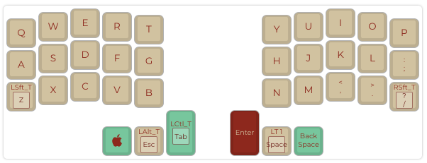
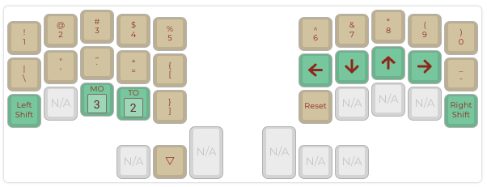
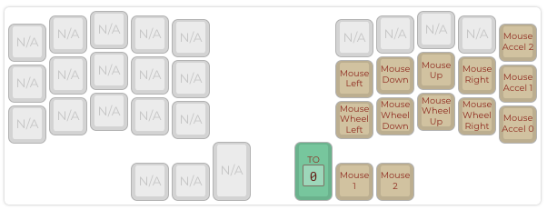
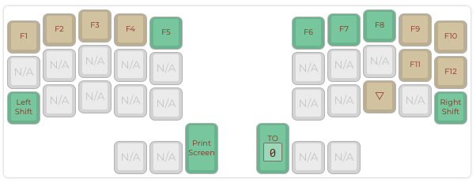

# crkbd-rev1-malik
mapping evolution of the ckbd/rev1 made by falba.tech helidox mini aka corne mini

## Layout

- go to [QMK Configurator](https://config.qmk.fm/#/crkbd/rev1/LAYOUT_split_3x5_3)
- check layout LAYOUT_split_3x5_3 is selected 
- upload layout.json
- compile and download firmware or use layout.hex
- flash firmware with QMK Toolbox or any another qmk toolkit

Alternatively, read https://github.com/foostan/crkbd/blob/main/doc/firmware_en.md
It's really worth it! You will find an alternative toolkit and more details on how to setup your crkbd corne keyboard.

## Layers

|layer|screenshot|
|-|-|
|L0||
|L1||
|L2||
|L3||
